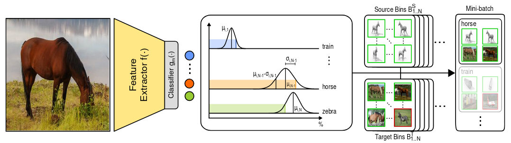

# Introduction

This repository contains the implementation of the unsupervised domain adaptation method proposed in our **BMVC 2021** paper "**UBR²S: Uncertainty-Based Resampling and Reweighting Strategy for Unsupervised Domain Adaptation**". Given the instructions below, the code can be used to exactly reproduce the results presented in the paper.

<p align="center">
  
</p>

# Basic setup

- Install environment with ```conda env create --file=environment.yaml --name UBR2S```
- Modify dataset paths in ```configs/global_config.yaml```, keep the \<domain>, \<class> and \<image> template parameters in the path
- Activate env with ```conda activate UBR2S```
- Run the scripts in the ```src/scripts/``` folder to reproduce our results. You can use the scripts as a template to run our method on other datasets.
- Note: Configs passed with the ```--config``` flag are read from left to right, i.e. keys in later configs can overwrite matching keys in earlier configs. 
  ```configs/global_config.yaml``` is always read first.
- The training output directory is also defined in ```global_config.yaml``` and makes use of the ```--sub-dir``` flag.


# Note on reproducibility

For reproducibility, we recommend using Ubuntu 18.04 with 4x 1080Ti GPUs and the above setup steps. Please note that any deviations from this setup can lead to different results.

# Citation

If you found our [paper](https://arxiv.org/abs/2110.11739) interesting or used our code in your research, please consider citing us.

```
@inproceedings{ringwald2021ubr2s,
    title={{UBR$^2$S: Uncertainty-Based Resampling and Reweighting Strategy for Unsupervised Domain Adaptation}},
    author={Ringwald, Tobias and Stiefelhagen, Rainer},
    booktitle={{The British Machine Vision Conference (BMVC)}},
    year={2021}
}
```
